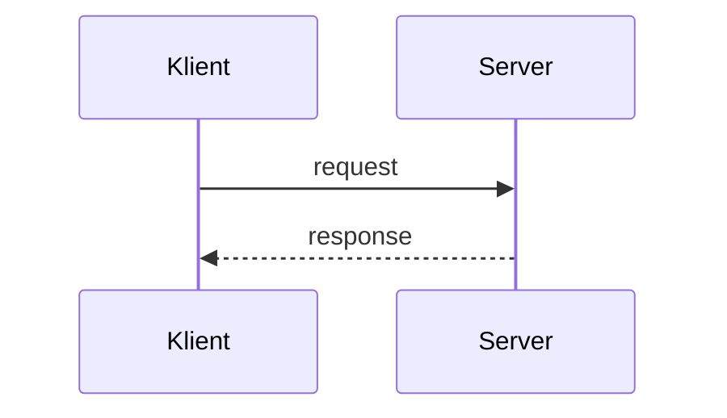
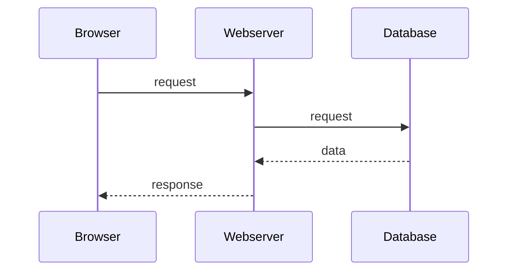
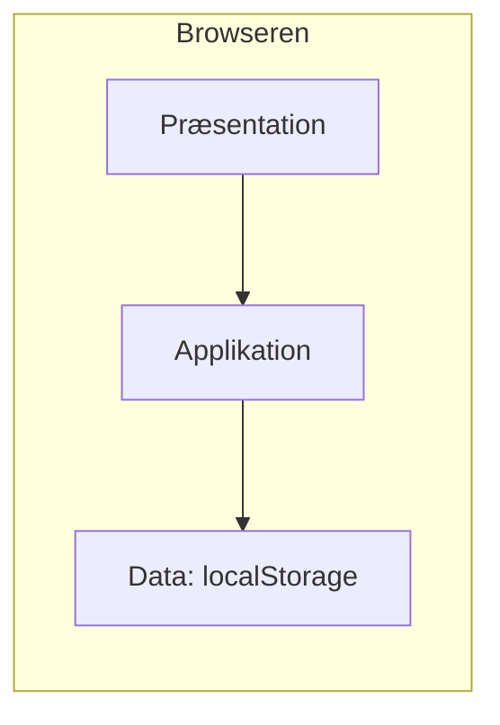
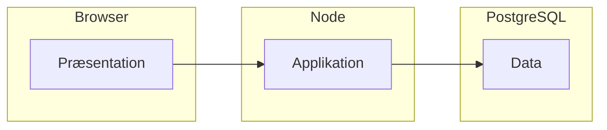
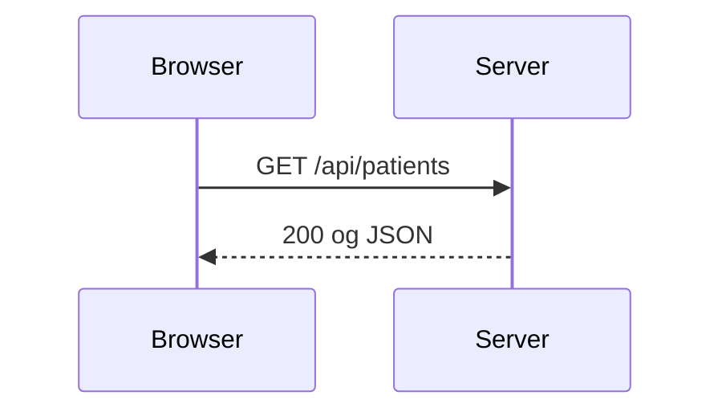
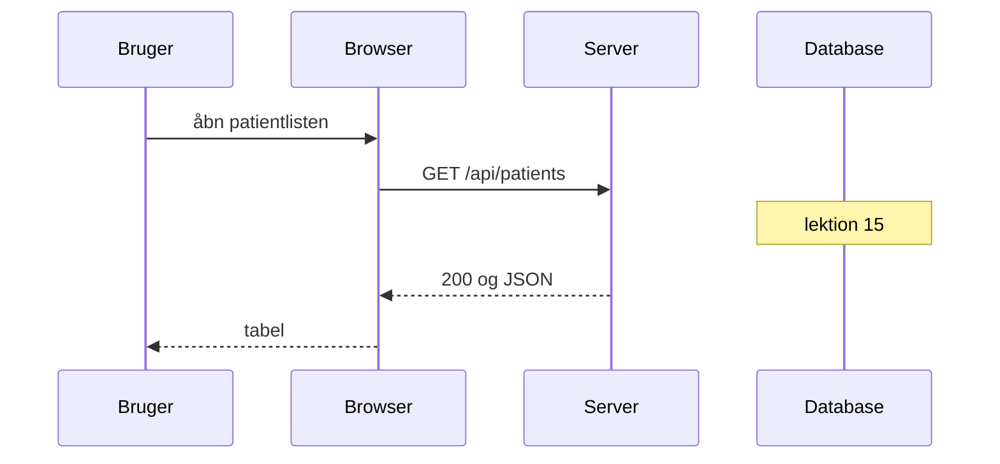

# Lektion 11 — Client-server

Christian Budtz — [chbu@dtu.dk](mailto:chbu@dtu.dk)

---

## Program i dag

- Opsamling: client-server, tynd og tyk, tre lag, Node
- Quiz: forberedelsen
- Øvelse 1: Jeres system
- Gennemgang: HTTP, nok til én server
- Gennemgang: `server.js`
- Quiz: request og response
- Øvelse 2: Skriv serveren
- Øvelse 3: Sekvensdiagrammet passer til kaldet

Pauser lægges ind undervejs.

---

## Læringsmål i dag

Efter lektionen skal du kunne:

- forklare at klienten anmoder, og at serveren venter og svarer
- skelne tynd og tyk klient og placere jeres mockup
- navngive præsentation, applikation og data for én handling i gruppen
- skrive en Node-server, der svarer JSON på `GET /api/patients` og 404 ellers
- pege tabellen på `localhost` og se, at listen bor i server-processen
- tegne sekvensdiagrammet for den handling, så pilene matcher kaldet

---

# Opsamling — forberedelsen

---

## Client-server

Klienten starter samtalen. Serveren venter og svarer. Uden et request sker der ingenting på serveren.

Klienten behøver ikke vide, hvordan svaret blev fundet. Den skal kende protokollen.



---

## Rollen kan skifte

I netbank-eksemplet er webserveren server for browseren. Samme webserver er klient, når den spørger databasen.



Det er separation of concerns. Hvert led svarer kun på det, det blev spurgt om.

---

## Tynd og tyk

En tynd klient viser. Serveren beslutter.

En tyk klient kan noget uden serveren. Wikipedia kalder det *rich client*. Vi siger tyk.

Jeres mockup er tykt. Præsentation, beslutninger og listen ligger i browseren. `localStorage` er ikke en server.

Et program, der aldrig sender eller modtager noget over nettet, er ikke en klient. Jeres `fetch` til underviser-API'et var allerede et request. Mockuppets egen liste var det ikke.

---

## Tre lag, ét sted

Et lag er et ansvar. En tier er et sted, det kører. Samme tre lag kan ligge på én maskine.

I mockuppet gør de det:



Præsentation er det, brugeren ser. Applikation er beslutningen. Data er det, der skal kunne hentes igen.

---

## Hvor lagene skal hen

Præsentationen bliver i browseren. Applikationen flytter over i serveren. I dag er den stadig bare en liste i processen. Datalaget bliver PostgreSQL i lektion 15.



---

## Node

JavaScript kan køre uden for browseren. Det er Node.

Browseren har DOM. Node har den ikke. Node kan tage imod HTTP.

I har kørt en fil med `node`. Processen skrev en linje og stoppede. Serveren er den proces, der bliver ved med at vente.

---

# Quiz — forberedelsen

---

## Quiz!

Gå til [/quiz](/quiz) og indtast koden fra tavlen.

**Lektion 11: forberedelse** — client-server, tynd og tyk, tre lag.

---

# Øvelse — jeres system

---

## Øvelse 1: Jeres system

Tynd eller tyk. De tre lag for jeres handling. Sekvensdiagram med bruger, browser, server og database.

Papir er fint. Detaljerne står i [øvelsesarket](oevelser.md).

Vi bruger skitsen igen, når serveren kører.

---

# Pause

---

# Gennemgang — HTTP

---

## Det kald, I allerede har

```js
const res = await fetch("https://it3e26.vercel.app/api/patients");
```

Browseren anmoder. En server svarer med JSON. I dag skriver I den server, for én liste.

`GET` henter. `POST` sender noget, der skal gemmes. I dag er det kun `GET`. Stien `/api/patients` er den ressource, requestet gælder. En anden sti er et andet request.

---

## Status og krop

`200` betyder: her er indholdet. `404` betyder: den sti findes ikke. Statuskoden er første linje i svaret. Den er ikke en del af JSON-listen.

På et `GET`, der lykkes, er kroppen listen. Samme felter som tabellen allerede læser:

```json
[{ "cpr": "2512489996", "navn": "Nancy Ann Test Berggren" }]
```

---

## Serveren husker ikke

HTTP er stateless. Næste request starter forfra. Derfor er `localStorage` ikke en session. Sessioner er lektion 19.

Siden og `localhost:3000` er to oprindelser. Browseren spørger kun på tværs, hvis svaret tillader det. Samme aside som i lektion 7:

```js
res.setHeader("Access-Control-Allow-Origin", "*");
```

---

# Gennemgang — serveren

---

## Én fil

`server.js` i det projekt, I allerede har. Ingen Express, ingen database, ingen HTML fra serveren. Lektion 13 åbner den samme fil igen.

Listen bor i processen. Det er ikke datalaget. Det er en liste i hukommelsen, så I kan se grænsen.

```js
const http = require("node:http");

const patients = [
  { cpr: "2512489996", navn: "Nancy Ann Test Berggren" },
  { cpr: "0107729995", navn: "Max Test Berggren" }
];
```

---

## Den venter på et request

```js
const server = http.createServer((req, res) => {
  res.setHeader("Access-Control-Allow-Origin", "*");
  res.setHeader("Content-Type", "application/json");

  if (req.method === "GET" && req.url === "/api/patients") {
    res.writeHead(200);
    res.end(JSON.stringify(patients));
    return;
  }

  res.writeHead(404);
  res.end(JSON.stringify({ error: "not found" }));
});

server.listen(3000);
```

Uden `listen` er der ingen server. Metode og sti skal begge passe. En forkert sti må ikke ligne en tom patientliste.

Det kald, der lykkes, ser sådan ud:



---

## Peg tabellen hertil

Start med `node server.js`. Åbn `http://localhost:3000/api/patients` og se JSON, før I rører ved tabellen.

Skift URL'en i det `fetch`, I allerede har, fra `https://it3e26.vercel.app/api/patients` til `http://localhost:3000/api/patients`. Tabellen kender felterne. Den skal ikke skrives om.

Ret et navn i listen, genstart processen, og hent igen. Navnet skifter, fordi dataene sidder i den proces, I startede. Ikke i `localStorage`.

Filen er ikke tre lag. Listen og svaret ligger samme sted. Express er lektion 13. PostgreSQL er lektion 15.

---

# Quiz — request og response

---

## Quiz!

Gå til [/quiz](/quiz) og indtast koden fra tavlen.

**Lektion 11: serveren** — metode, sti, status og JSON.

---

# Pause

---

# Øvelser

**Man lærer grænsen ved at starte processen selv.**

Detaljerne står i [øvelsesarket](oevelser.md).

---

## Øvelse 2: Skriv serveren

Skriv `server.js`. `GET /api/patients` svarer 200 og JSON. Alt andet svarer 404.

Tabellen henter fra `localhost:3000`. Et ændret navn ses efter genstart.

---

## Øvelse 3: Pilene matcher kaldet

Opdatér sekvensdiagrammet fra øvelse 1, så det er det kald, I lige har kørt. Databasen er med, men I har ikke spurgt den endnu.



Diagrammet skal handle om gruppens egen handling, ikke om netbanken.
