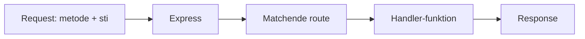
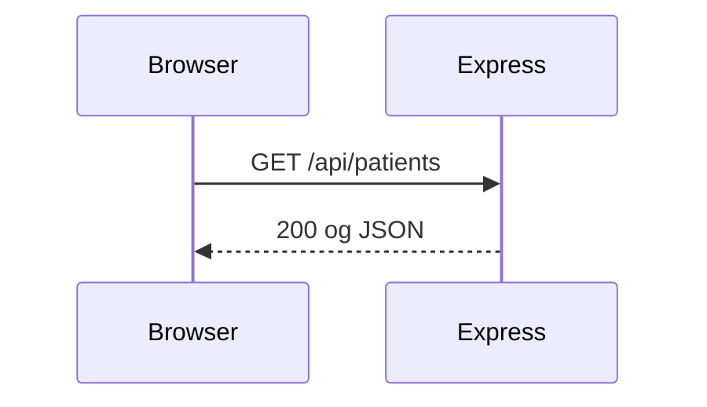
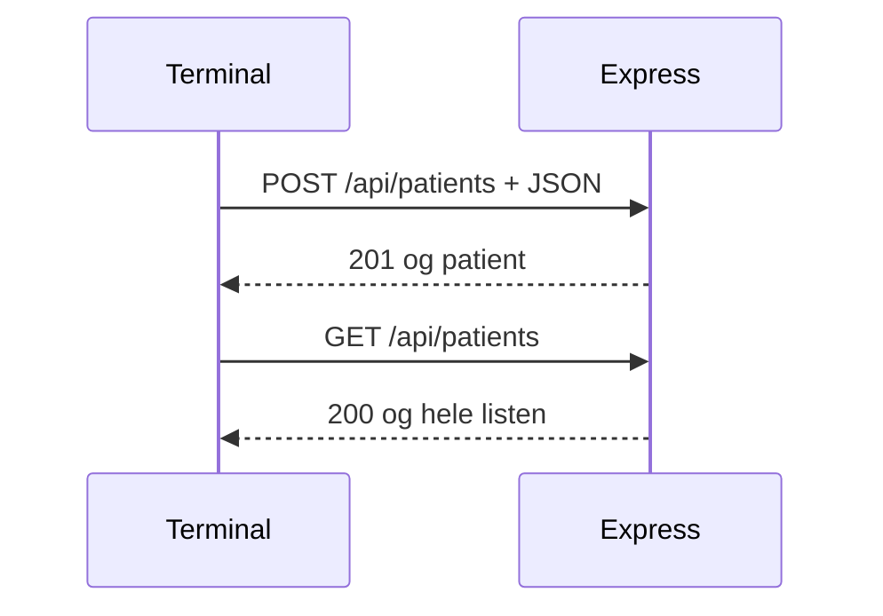

# Lektion 13 — Express og routes

Christian Budtz — [chbu@dtu.dk](mailto:chbu@dtu.dk)

---

## Program i dag

- Opsamling: framework, route, `my-app`
- Quiz: forberedelsen
- Øvelse 1: Samme valg, anden syntaks
- Gennemgang: npm og omskriv `server.js`
- Quiz: routes og 404
- Øvelse 2: Express i projektet
- Gennemgang: curl og `POST`
- Quiz: body og status
- Øvelse 3: `POST` med curl
- Øvelse 4: Tabellen mod jeres server

Pauser lægges ind undervejs.

---

## Læringsmål i dag

Efter lektionen skal du kunne:

- forklare at jeres `if` i lektion 11 og en Express-route er det samme valg: metode, sti og handler
- omskrive `server.js` til Express med samme `GET /api/patients` og 404 på resten
- tilføje `POST /api/patients`, så listen i hukommelsen vokser
- teste `GET` og `POST` med curl uden browseren
- se en ny patient både i JSON og i tabellen, når den henter fra `localhost`

---

# Opsamling — forberedelsen

---

## Node venter stadig

`http.createServer` og Express starter begge en proces, der lytter. Uden
`listen` sker der ingenting. Port 3000 er den samme adresse, I brugte i
lektion 11.

Forskellen er, hvordan I vælger handler. I L11 skrev I det selv:

```js
if (req.method === "GET" && req.url === "/api/patients") {
  // ...
}
```

---

## Express er valget som route

En route er metode, sti og funktion. `app.get("/api/patients", …)` er det
`if`, der tjekker `GET` og stien. `app.post(…)` er det samme for `POST`.

Express ligger oven på Node. Den kalder stadig jeres handler, når et request
kommer ind. Frameworket organiserer valget — det erstatter ikke HTTP.



---

## Svar: `send` og `json`

`res.send("Hello World!")` sender tekst. `res.json(patients)` sender JSON
og sætter passende `Content-Type`. Det er det, jeres L11-server gjorde med
`JSON.stringify` og headeren `application/json`.

`res.status(404)` sættes før svaret sendes. I L11 skrev I
`writeHead(404)`. Samme idé.

---

## `my-app` og projektet

I forberedelsen kørte I `index.js` i en mappe for sig. Adresserne
`/` og `/api/patients` viste, at to routes kan leve i samme proces.

I timen åbner vi **gruppens** `server.js` igen. Listen og tabellen er
jeres. Express kommer ind i den fil — ikke i en ny demo-mappe.

---

## Hvad vi ikke tager i dag

Route parameters (`/api/patients/:id`), `express.Router()`, static files og
`res.render` er bevidst ude. PostgreSQL er lektion 15. Login og session er
senere.

---

# Quiz — forberedelsen

---

## Quiz!

Gå til [/quiz](/quiz) og indtast koden fra tavlen.

**Lektion 13: forberedelse** — Express, route, `send` og `json`.

---

# Øvelse — samme valg

---

## Øvelse 1: Samme valg, anden syntaks

Sæt jeres L11-`if` ved siden af `app.get` fra `my-app`. Hvilke tre dele
matcher metode, sti og handler?

Detaljerne står i [øvelsesarket](oevelser.md).

---

# Pause

---

# Gennemgang — Express i `server.js`

---

## npm og afhængighed

Express er et npm-modul. I projektmappen:

```bash
npm init -y
npm install express
```

`package.json` og `node_modules/` hører til projektet. Commit
`package.json` og `package-lock.json`. Commit ikke `node_modules/`.

Start serveren med `node server.js` — samme kommando som før.

---

## Skelet

```js
const express = require("express");

const app = express();

const patients = [
  { cpr: "2512489996", navn: "Nancy Ann Test Berggren" },
  { cpr: "0107729995", navn: "Max Test Berggren" }
];
```

`patients` er stadig listen i processen. Ikke datalaget. Ikke
`localStorage`. Ikke PostgreSQL endnu.

---

## CORS og JSON-body

Browseren henter stadig fra en anden oprindelse end `localhost:3000`. Behold
headeren fra lektion 11:

```js
app.use((req, res, next) => {
  res.setHeader("Access-Control-Allow-Origin", "*");
  next();
});

app.use(express.json());
```

`express.json()` læser JSON i body på `POST`. Uden den middleware er
`req.body` tom.

---

## `GET` og 404

```js
app.get("/api/patients", (req, res) => {
  res.json(patients);
});

app.use((req, res) => {
  res.status(404).json({ error: "not found" });
});

app.listen(3000);
```

Den sidste handler fanger alt, ingen route matchede. Det er jeres gamle
`else` med 404 — ikke en tom liste.

Adfærden skal matche lektion 11, før I tilføjer `POST`:



---

## Peg tabellen hertil

`fetch` skal stadig pege på `http://localhost:3000/api/patients`. Felterne
er uændrede. Genstart processen efter omskrivningen, og tjek at JSON i
browseren og rækkerne i tabellen matcher.

---

# Quiz — routes og 404

---

## Quiz!

Gå til [/quiz](/quiz) og indtast koden fra tavlen.

**Lektion 13: routes** — `app.get`, catch-all og listen i hukommelsen.

---

# Pause

---

# Øvelser — Express i projektet

---

## Øvelse 2: Express i projektet

Omskriv `server.js`. `npm install express`. Samme `GET`, samme 404, samme
CORS. Tabellen skal stadig vise listen.

Detaljerne står i [øvelsesarket](oevelser.md).

---

# Gennemgang — curl og POST

---

## Hvorfor curl

Browseren er god til `GET`. Den viser JSON pænt og kører jeres `fetch`.

`POST` med en JSON-body er akavet i adresselinjen. **curl** sender et request
fra terminalen — uden HTML. I tester API'et, ikke siden.

Samme protokol som browseren: metode, sti, headers, body.

---

## `GET` med curl

Med serveren kørende:

```bash
curl http://localhost:3000/api/patients
```

Outputtet skal ligne det, I ser i browseren. Statuskoden kan I se med `-i`
(headers med) eller `-w "\n%{http_code}\n"`.

Forkert sti skal stadig give 404 og `{"error":"not found"}` — ikke 200 med
en tom liste.

---

## `POST` — noget skal gemmes

`GET` henter listen. `POST /api/patients` sender én ny patient i body. Serveren
**appender** til `patients` og svarer, at det lykkedes.

```js
app.post("/api/patients", (req, res) => {
  const { cpr, navn } = req.body;
  if (!cpr || !navn) {
    return res.status(400).json({ error: "cpr og navn skal med" });
  }
  patients.push({ cpr, navn });
  res.status(201).json({ cpr, navn });
});
```

`201 Created` betyder: ressourcen blev oprettet. `400` betyder: body manglede
noget. Det er applikationslagets svar — ikke Express-magi.

---

## curl med JSON-body

```bash
curl -X POST http://localhost:3000/api/patients ^
  -H "Content-Type: application/json" ^
  -d "{\"cpr\":\"0201029994\",\"navn\":\"Ny Test Person\"}"
```

På macOS/Linux: brug `\` i stedet for `^` til linjeskift. Én linje uden
skift virker overalt.

Derefter:

```bash
curl http://localhost:3000/api/patients
```

Den nye patient skal stå i arrayet. Genstart processen — listen er tom
igen, medmindre I har gemt den et andet sted. Det er lektion 15.



---

## Applikation, ikke database

`push` skriver i hukommelsen i den kørende proces. Filen `server.js` er
stadig ikke tre lag. Applikationslogikken sidder nu i routes i stedet for ét
stort `if`. Tabellen i PostgreSQL kommer i lektion 15. Routen kalder
den i lektion 17.

---

# Quiz — POST og body

---

## Quiz!

Gå til [/quiz](/quiz) og indtast koden fra tavlen.

**Lektion 13: POST** — `express.json`, statuskoder og curl.

---

# Pause

---

# Øvelser — POST og projekt

---

## Øvelse 3: POST med curl

Tilføj `POST /api/patients`. Opret en patient med curl. Verificér med `GET`
i curl og i browseren.

Detaljerne står i [øvelsesarket](oevelser.md).

---

## Øvelse 4: Tabellen mod jeres server

Tabellen henter fra jeres Express-server. Efter curl-`POST` skal en refresh
eller genhentning vise den nye række. Gruppens mockup er stadig tyk klient
på Vercel — men patientlisten til øvelsen kommer fra `localhost`.

Detaljerne står i [øvelsesarket](oevelser.md).
