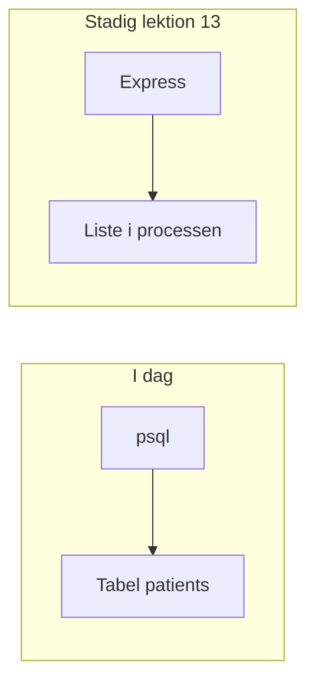

# Lektion 15 — PostgreSQL og SQL

Christian Budtz — [chbu@dtu.dk](mailto:chbu@dtu.dk)

---

## Program i dag

- Opsamling: tabel, nøgler, `SELECT`, `WHERE`, `INSERT`
- Quiz: forberedelsen
- Gennemgang: `psql` og `CREATE TABLE`
- Quiz: tabel og typer
- Øvelse 1: Patienttabellen
- Gennemgang: `UPDATE` og `DELETE`
- Quiz: `WHERE` før skrivning
- Øvelse 2: Ret, slet, og de fem testpatienter
- Øvelse 3: Gruppens tabel

Pauser lægges ind undervejs.

---

## Læringsmål i dag

Efter lektionen skal du kunne:

- forklare tabel, række, kolonne, primærnøgle og fremmednøgle
- skrive `SELECT`, `WHERE` og `INSERT`, og oprette tabellen med `CREATE TABLE`
- lægge patienter i PostgreSQL og hente dem igen med `WHERE`
- ændre og slette en række med `UPDATE` og `DELETE`, efter `WHERE` er prøvet med `SELECT`
- se med `SELECT` og `\d`, at rækken er der eller væk
- sige, at Express-listen stadig bor i processen

---

# Opsamling — forberedelsen

---

## To steder, to lister

Patientlisten i `server.js` ligger i den kørende proces. Genstart sletter den.
En tabel i PostgreSQL ligger uden for processen. I dag skriver I til tabellen
fra `psql`. Routen kender den endnu ikke.



---

## Række og kolonne

En tabel har navngivne kolonner og et vilkårligt antal rækker. Én række er én
patient. Kolonnerne er de felter, rækken altid har.

I SQLBolt hed tabellen `movies`. Kolonnerne var titel, år og instruktør. Det
er samme form som patientlisten: `cpr` og `navn`.

---

## De tre sætninger fra SQLBolt

`SELECT` henter kolonner. `WHERE` beholder de rækker, betingelsen passer på.
`INSERT INTO` med kolonnenavne lægger en ny række i.

```sql
SELECT title, year
FROM movies
WHERE year = 1995;

INSERT INTO movies (title, year, director)
VALUES ('Toy Story', 1995, 'John Lasseter');
```

Tekst står i enkelte anførselstegn. Hver sætning slutter med semikolon.

---

## Nøgler

En primærnøgle udpeger én række. To rækker må ikke have den samme værdi, og
værdien må ikke mangle.

En fremmednøgle er en kolonne, der peger på primærnøglen i en anden tabel.
`maalinger.patient_id` peger på `patients.id`, så en måling kan findes igen
på den patient, den hører til. I dag opretter I kun `patients`.

---

## Hvad vi ikke tager i dag

Joins og en anden tabel venter, til gruppen har to slags rækker. `server.js`
skal blive stående. At `app.get` kalder tabellen, er lektion 17.

---

# Quiz — forberedelsen

---

## Quiz!

Gå til [/quiz](/quiz) og indtast koden fra tavlen.

**Lektion 15: forberedelse** — tabel, `SELECT`, `WHERE`, `INSERT` og nøgler.

---

# Gennemgang — tabellen i PostgreSQL

---

## `psql`

`psql` er den terminal, der sender SQL til PostgreSQL. Prompten viser, hvilken
database du er forbundet til:

```text
postgres=#
lektion15=>
```

`\l` lister databaser. `\c lektion15` skifter database. `\d` viser tabellerne
i den database, du er i. `\d patients` viser kolonner og nøgler. Detaljerne
til installation står i [øvelsesarket](oevelser.md).

---

## Opret databasen og tabellen

```sql
CREATE DATABASE lektion15;
```

```sql
\c lektion15

CREATE TABLE patients (
  id SERIAL PRIMARY KEY,
  cpr VARCHAR(10) NOT NULL UNIQUE,
  navn VARCHAR(200) NOT NULL
);
```

`SERIAL` nummererer `id` selv, fra 1 og op. `PRIMARY KEY` på `id` gør den
til rækkens identitet. `UNIQUE` på `cpr` siger, at samme CPR ikke må findes
to gange.

---

## CPR er tekst

Max Test Berggren har CPR `0107729995`. Et tal må ikke starte med 0, så
PostgreSQL ville gemme `107729995`. `VARCHAR` gemmer tegnene, som de står.

```sql
INSERT INTO patients (cpr, navn)
VALUES ('0107729995', 'Max Test Berggren');
```

`id` er udeladt. `SERIAL` sætter den.

---

## Hent den række, du lige lagde i

```sql
SELECT id, cpr, navn
FROM patients
WHERE cpr = '0107729995';
```

`SELECT *` henter alle kolonner. Skriv kolonnenavnene, når du vil se, at
`cpr` stadig har det foranstillede 0.

---

# Quiz — tabel og typer

---

## Quiz!

Gå til [/quiz](/quiz) og indtast koden fra tavlen.

**Lektion 15: tabel** — `CREATE TABLE`, `SERIAL`, `VARCHAR` og `\d`.

---

# Øvelser

---

## Øvelse 1: Patienttabellen

Opret `lektion15` og `patients`. Læg to rækker i, og hent dem med `WHERE`.

- `psql` er forbundet til `lektion15`
- `cpr` er `VARCHAR`
- `server.js` er urørt

Detaljerne står i [øvelsesarket](oevelser.md).

---

# Pause

---

# Gennemgang — ret og slet

---

## Prøv `WHERE` med `SELECT` først

`UPDATE` og `DELETE` rammer hver række, som `WHERE` passer på. Uden `WHERE`
rammer de hele tabellen.

Skriv betingelsen som en `SELECT`, og se, at det er den ene række, du mener:

```sql
SELECT id, cpr, navn
FROM patients
WHERE cpr = '2512489996';
```

Først når den viser Nancy, og kun Nancy, bruger du samme `WHERE` til at
skrive.

---

## `UPDATE`

```sql
UPDATE patients
SET navn = 'Nancy Test Berggren'
WHERE cpr = '2512489996';
```

`SET` er de kolonner, der ændres. De andre kolonner bliver stående. Kør
`SELECT` med samme `WHERE` bagefter, og læs navnet.

---

## `DELETE`

```sql
DELETE FROM patients
WHERE cpr = '0000000000';
```

Rækken er væk. En ny `SELECT` med samme `WHERE` skal give nul rækker.
`DELETE` uden `WHERE` tømmer tabellen.

---

## De fem testpatienter

Numrene er [MedComs test-CPR](https://medcom.dk/standarder/tabeller/nationale-test-cpr-numre/).
De må kun bruges i undervisning. Password hører ikke til i denne tabel. Det
samme gør listen i lektion 7: `cpr` og `navn`.

| CPR | Navn |
| --- | --- |
| `2512489996` | Nancy Ann Test Berggren |
| `2911829996` | Kirsten Test Berggren |
| `0107729995` | Max Test Berggren |
| `1509819996` | Brita Test Berggren |
| `3103979995` | Anders Test Jensen |

---

# Quiz — `WHERE` før skrivning

---

## Quiz!

Gå til [/quiz](/quiz) og indtast koden fra tavlen.

**Lektion 15: ret og slet** — `UPDATE`, `DELETE` og `WHERE`.

---

# Øvelser

---

## Øvelse 2: Ret, slet, og de fem

Ret et navn, slet en række, I selv har lagt i ved en fejl, og sørg for, at
de fem testpatienter ligger i `patients`.

## Øvelse 3: Gruppens tabel

Opret én tabel til gruppens projekt i samme database. Læg én syntetisk række
i, og hent den. Skriv fremmednøglen på papir, hvis I har to slags rækker.

Detaljerne står i [øvelsesarket](oevelser.md).
