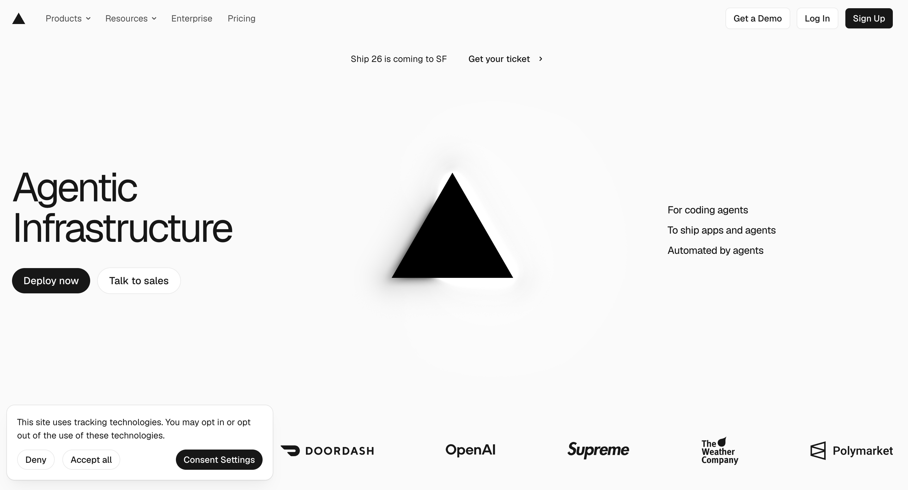
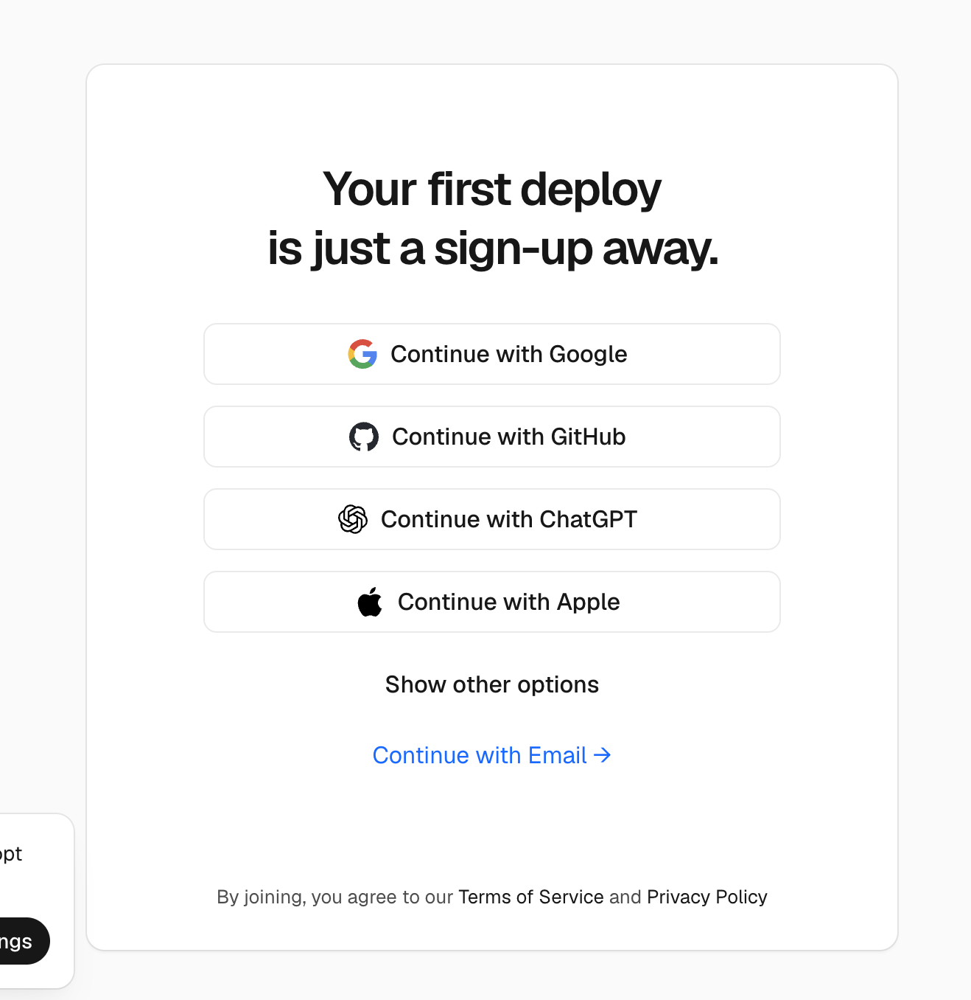
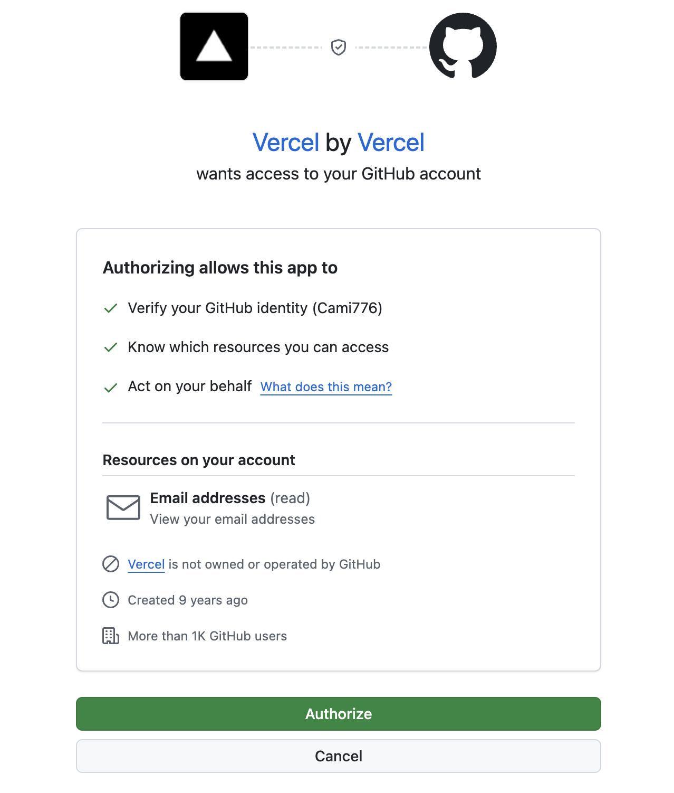
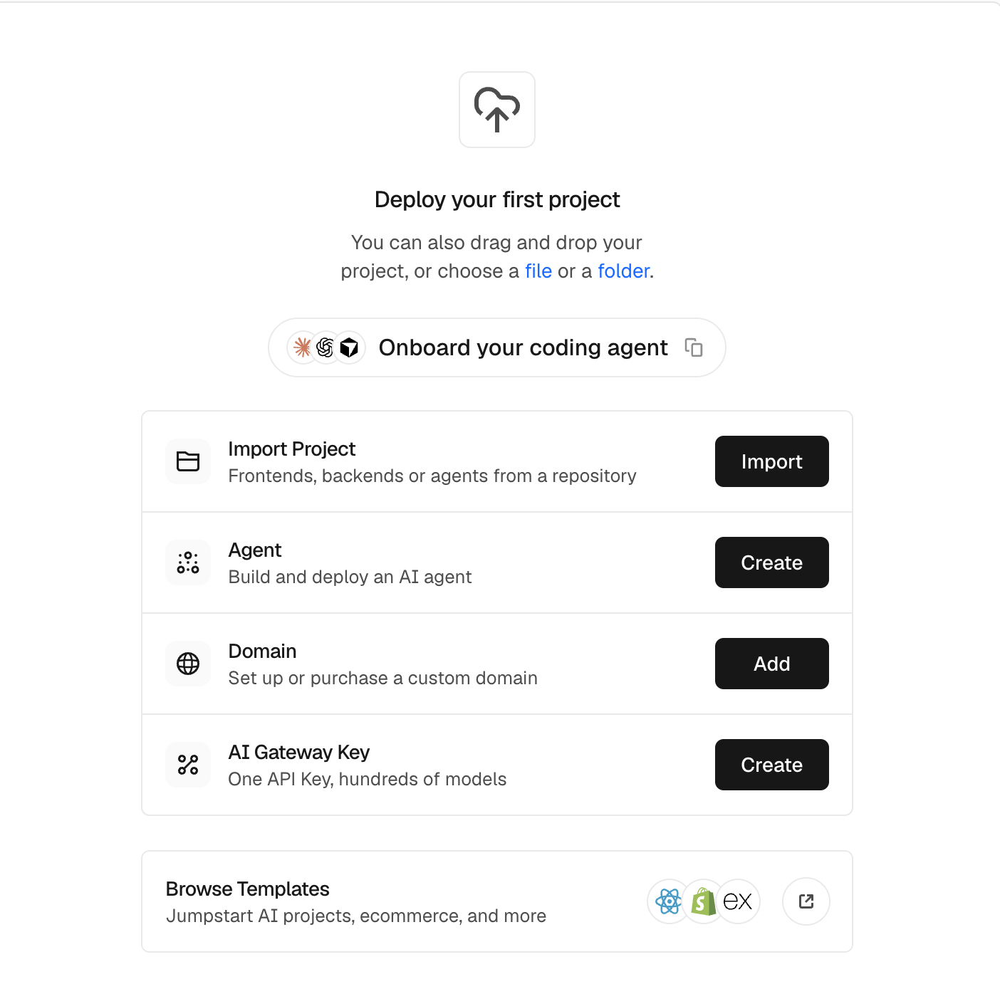
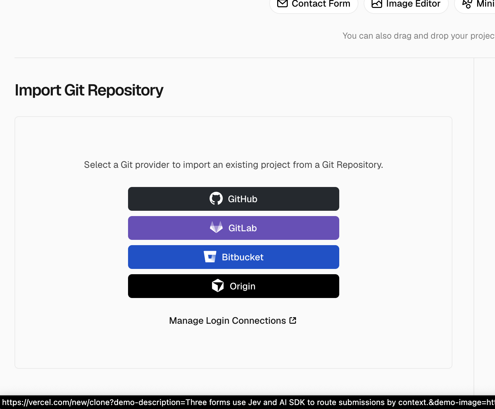
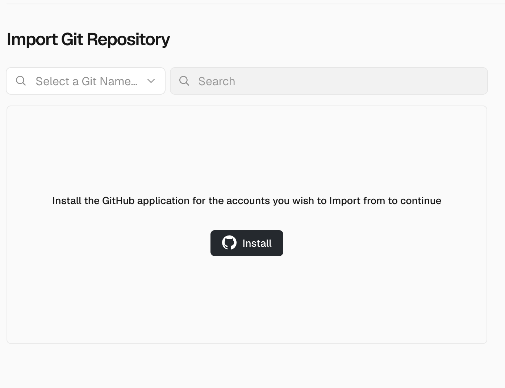
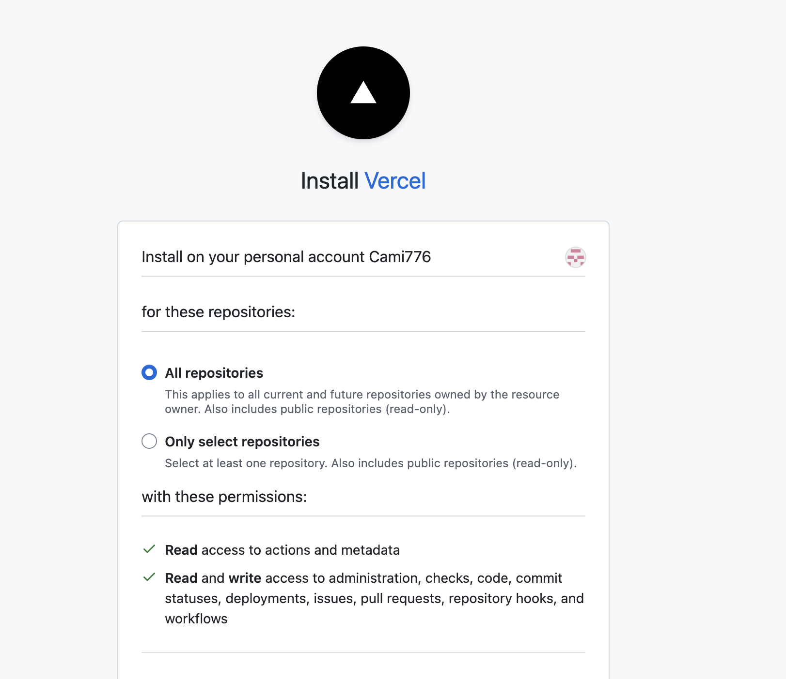
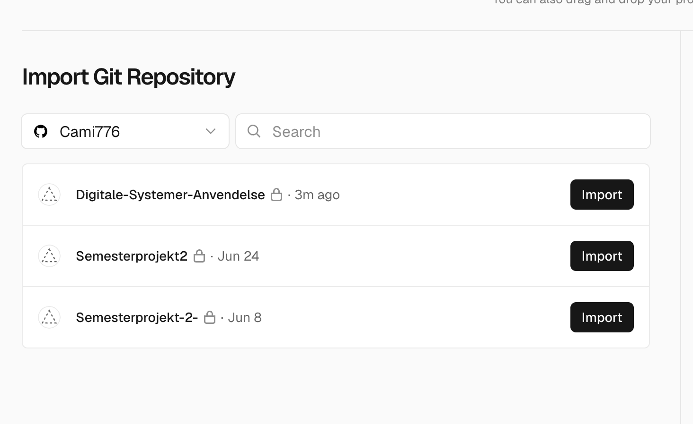
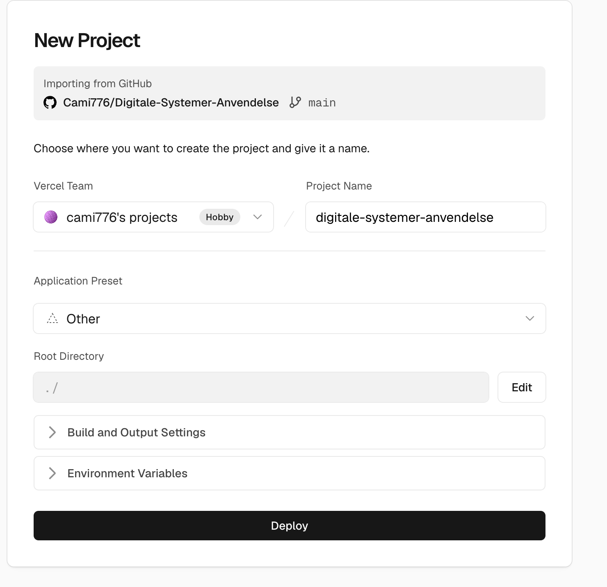
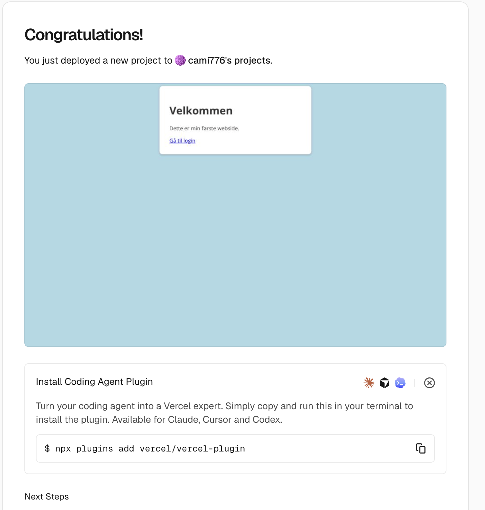

# Lektion 9 — Øvelser

Man lærer tilstand bedst ved at prøve selv. Dette ark samler dagens fire
øvelser med den uddybning, der ikke kan være på slidesne.

Hvis du ikke nåede [forberedelsen](forberedelse.md), så start der — eller gør
det parallelt med Øvelse 1.


| Øvelse                          | Hvornår                     | Tid     |
| ------------------------------- | --------------------------- | ------- |
| **1** Login-state               | Efter forberedelses-quizzen | ~15 min |
| **2** Kladde til et notat       | Efter tilstands-quizzen     | ~35 min |
| **3** URL til mockuppet         | Efter Vercel-gennemgangen   | ~25 min |
| **4** Videre på D1              | Efter øvelse 3              | ~45 min |


AI er tilladt, men du skal kunne forklare hver linje, du skriver. En løsning,
du ikke kan gennemgå, tæller ikke.

---

## Øvelse 1 — Login-state

**Mål:** Topbaren viser, hvem der er logget ind, og hvor mange minutter der
er til logout. Et refresh logger jer ud, indtil tilstanden med udløb ligger
i `localStorage` og læses igen, når siden starter.

Arbejd i `login.html` fra Lektion 7 (eller den side, et vellykket login
lander på). Login-kaldet har I allerede: `POST` til
`https://it3e26.vercel.app/api/login`. I gemmer **ikke** password, **ikke**
CPR og **ikke** patientlisten.

### 1. Vis login-state

Tilføj en topbar øverst på siden:

```html
<p id="topbar" hidden></p>
```

Link til stilarket i `head`: `<link rel="stylesheet" href="login.css">`.
En anelse, i `login.css`. Sæt ikke `display` på `#topbar` — så vinder den
over `hidden`.

```css
body { margin: 0; }
#topbar { position: sticky; top: 0; margin: 0; padding: 0.6rem 1rem;
  background: #0f2c4c; color: #fff; }
```

Tilstanden bor i en variabel. `expiresAt` er et tidspunkt 5 minutter frem, så I kan se udløbet i timen.

```js
let login = null;

function visLogin() {
  const bar = document.getElementById("topbar");
  if (login && login.expiresAt <= Date.now()) {
    login = null;
    localStorage.removeItem("login");
  }
  if (!login) {
    bar.hidden = true;
    return;
  }
  const minutter = Math.ceil((login.expiresAt - Date.now()) / 60000);
  bar.hidden = false;
  bar.textContent = login.navn + " · " + minutter + " min til logout";
}

setInterval(visLogin, 1000);
```

Når `POST /api/login` svarer 200, sæt variablen og vis baren. Gem ikke endnu.

```js
login = {
  navn: data.navn,
  expiresAt: Date.now() + 5 * 60 * 1000
};
visLogin();
```

`data.navn` kommer fra 200-svaret. Password fra formularen må ikke med i
objektet.

### 2. Refresh

Genindlæs siden.

Topbaren er væk. I er logget ud. Variablen døde med siden. Det er meningen —
I har ikke gemt tilstanden.

### 3. Gem, og læs ved opstart

Når login lykkes, skriv den samme variabel til lageret:

```js
localStorage.setItem("login", JSON.stringify(login));
```

Når scriptet starter, før I venter på et nyt login: læs nøglen. Vis baren
kun, hvis udløbet stadig ligger i fremtiden. Ellers slet nøglen.

```js
const gemt = localStorage.getItem("login");
if (gemt) {
  const parsed = JSON.parse(gemt);
  if (parsed.expiresAt > Date.now()) {
    login = parsed;
    visLogin();
  } else {
    localStorage.removeItem("login");
  }
}
```

Refresh igen inden de fem minutter. Navnet er der, og minutterne tæller
videre fra det gemte `expiresAt`.

Når tiden er gået, skjuler `visLogin` baren og sletter nøglen. I kan også
sætte `expiresAt` til et tidspunkt i fortiden under **Application** →
**Local Storage** og genindlæse.

Lageret er browseren på den her computer. Serveren har stadig ingen session.

### Tjekliste

- [ ] Efter login viser topbaren navn og minutter til logout.
- [ ] Refresh **før** `setItem`: baren er væk.
- [ ] Nøglen `login` er JSON med `navn` og `expiresAt`.
- [ ] Password, CPR og patientlisten ligger ikke i `localStorage`.
- [ ] Refresh inden udløb viser den samme topbar.
- [ ] Efter udløb er baren væk, og `getItem("login")` giver `null`.

**Øvelsen er i hus**, når et refresh inden udløb stadig viser navn og
minutter, og et refresh efter udløb logger jer ud.

### Hvis du sidder fast

- Baren kommer ikke frem: kalder du `visLogin` efter du har sat `login`, og
har elementet id `topbar`?
- Refresh glemmer jer, selv om I har gemt: kører læsningen, når scriptet
starter, og parser I kun når `getItem` ikke er `null`?
- I er logget ind efter udløb: sammenligner du `expiresAt` med `Date.now()`
både i `visLogin` og ved opstart?
- `JSON.parse` kaster: værdien i lageret skal komme fra `JSON.stringify`.
- Bed en sidekammerat eller underviseren om at kigge med. Vis koden, ikke
bare fejlen.

### Hvis du har ekstra tid

- En knap **Log ud** sætter `login = null`, kalder
`localStorage.removeItem("login")` og `visLogin()`.

---

## Øvelse 2 — Kladde til et notat

**Mål:** Forhåndsvisningen tegnes fra en variabel. `setKladde` er den eneste
måde at ændre teksten på. Uden lager forsvinder kladden ved refresh. Med
lager er den der igen.

Arbejd i en ny `notat.html`, eller på den side i mockuppet hvor I indtaster
noget. Login-state fra øvelse 1 rører I ikke. I gemmer **ikke** password,
**ikke** CPR og **ikke** patientlisten. Teksten er syntetisk.

### 1. Vis kladden

```html
<label for="kladde-tekst">Notat</label>
<textarea id="kladde-tekst"></textarea>
<p id="forhaand"></p>
```

```js
let kladde = { tekst: "" };

function renderKladde() {
  const vis = document.getElementById("forhaand");
  vis.textContent = kladde.tekst || "Intet notat endnu";
}

function setKladde(next) {
  kladde = next;
  renderKladde();
}

document.getElementById("kladde-tekst").addEventListener("input", (event) => {
  setKladde({ tekst: event.target.value });
});

renderKladde();
```

Skriv et par linjer. Forhåndsvisningen følger med. I konsollen ændrer
`kladde.tekst = "hej"` ikke visningen. Kun `setKladde` gør.

### 2. Refresh

Genindlæs siden. Feltet og forhåndsvisningen er tomme. Variablen døde med
siden. Det er meningen — I har ikke gemt kladden.

### 3. Gem, og læs ved opstart

Tilføj én linje i `setKladde`, efter `kladde = next`:

```js
localStorage.setItem("kladde", JSON.stringify(kladde));
```

Når scriptet starter, før lytteren:

```js
const gemt = localStorage.getItem("kladde");
if (gemt) {
  kladde = JSON.parse(gemt);
  document.getElementById("kladde-tekst").value = kladde.tekst;
  renderKladde();
}
```

Refresh. Teksten er i feltet og i forhåndsvisningen.

Nøglen `kladde` er JSON med `tekst`. Ikke et CPR, ikke et navn fra
patientlisten, ikke et password.

### Tjekliste

- [ ] Forhåndsvisningen følger feltet, mens I skriver.
- [ ] `kladde.tekst = "..."` i konsollen tegner ikke forhåndsvisningen.
- [ ] Refresh **før** `setItem`: feltet er tomt.
- [ ] Nøglen `kladde` er JSON med `tekst`.
- [ ] Password, CPR og patientlisten ligger ikke i `localStorage`.
- [ ] Refresh efter `setItem` viser den samme tekst.

**Øvelsen er i hus**, når et refresh viser kladden igen, og I kan pege på
at det er `setKladde`, der både gemmer og tegner.

### Hvis du sidder fast

- Forhåndsvisningen står stille: kalder `input`-lytteren `setKladde`, og
kalder `setKladde` `renderKladde`?
- Feltet er tomt efter refresh, men **Local Storage** har nøglen: sætter I
`textarea.value` fra den læste kladde, eller kun forhåndsvisningen?
- `JSON.parse` kaster: tjek for `null` fra `getItem`, før I parser.
- Bed en sidekammerat eller underviseren om at kigge med. Vis koden, ikke
bare fejlen.

### Hvis du har ekstra tid

- Knappen **Log ud** fra øvelse 1 kalder også `localStorage.removeItem("kladde")`.

---

## Øvelse 3 — URL til mockuppet

**Mål:** Gruppens mockup kan åbnes på en `https://….vercel.app`-adresse.
Det er den adresse, I afleverer til D1.

Arbejd i **gruppens GitHub-repository**. HTML, CSS og JavaScript skal være
committet og pushet. Én i gruppen ejer Vercel-projektet og deler URL'en, så
de andre kan se siden.

> **Vigtigt: Kun ejeren af Vercel-projektet kan udløse et deploy.**
> Den gratis Hobby-plan blokerer pushes fra alle andre i gruppen. Deres
> commits kommer på GitHub, men ikke på den offentlige side.
>
> Når en anden i gruppen har pushet, gør **ejeren** sådan:
>
> 1. Pull de nyeste ændringer: `git pull`.
> 2. Lav en ligegyldig ændring, fx et ekstra mellemrum i en kommentar.
> 3. Commit og push.
>
> Nu deployer Vercel siden med alle gruppens commits.

Billederne er fra et eksempel-repository. I vælger **gruppens** repository,
ikke det, der står på billedet.

Kontoen er oprettet i forberedelsen. Start ved **Import**.

### Mangler kontoen

1. Åbn [https://vercel.com](https://vercel.com) og vælg **Sign Up**.
  
2. Vælg **Continue with GitHub**.
  
3. Godkend at Vercel må bruge jeres GitHub-konto: **Authorize**.
  

### Det skal I nå

1. Log ind på [https://vercel.com](https://vercel.com). På **Deploy your
  first project** — **Import** ud for **Import Project**.
   
2. Vælg **GitHub**.
  
3. Hvis listen er tom, står der **Install**. Tryk den.
  
4. Vælg bare **All repositories**. I kan også vælge det specifikke projekt.
  Scroll ned og afslut installationen.
   
5. Find gruppens repository, og tryk **Import** på den række.
  
6. På **New Project**:
  - **Application Preset** skal være **Other**. I udfylder ikke en
   build-kommando.
  - **Root Directory** er `./`, når `index.html` ligger i repo-roden.
  Ellers tryk **Edit** og vælg mappen med `index.html`.
  - Fold ikke **Environment Variables** ud. I har ingen server.
  - Tryk **Deploy**. Hobby-planen er den gratis.
   
7. **Congratulations** betyder, at siden er oppe. Forhåndsvisningen er
  jeres mockup. Ignorér boksen **Install Coding Agent Plugin**, og kør
   ikke kommandoen deri. URL'en ender på `.vercel.app`. Åbn den i et
   vindue, hvor I ikke er logget ind på Vercel.
   
8. Lav en lille synlig ændring, commit, push, og genindlæs URL'en når
  deployet er færdigt. Ændringen skal være på den offentlige side.

I deployer ikke en server. `fetch` mod underviser-API'et må gerne blive i
mockuppet. Kaldet skal gå til `https://it3e26.vercel.app`, ikke til en fil
på jeres computer.

### Tjekliste

- [ ] URL'en åbner mockuppet og ikke en Vercel-404.
- [ ] CSS og JavaScript indlæses (Network i DevTools på den offentlige URL).
- [ ] Et nyt push ændrer den offentlige side.
- [ ] Repositoryet indeholder ikke passwords eller rigtige persondata.

### Tjek resultatet

Send URL'en til en anden i gruppen, som ikke kører siden lokalt. De skal
kunne åbne mockuppet.

**Øvelsen er i hus**, når den offentlige URL viser mockuppet, og I kan
pege på det commit, siden er bygget fra.

### Hvis I sidder fast

- 404: Root Directory er forkert, eller `index.html` er ikke pushet.
- Siden er gammel: se i Vercel under **Deployments**, om det seneste push
er **Ready**, og om produktion peger på den branch, I pusher til.
- Deployet står som **Blocked**: en anden end ejeren har pushet. Ejeren
skal pulle, lave en ligegyldig ændring og pushe (se boksen øverst i
øvelsen).
- `fetch` fejler kun på URL'en: tjek at adressen er
`https://it3e26.vercel.app/api/patients` og ikke en relativ sti til en
fil, der kun findes på din computer.
- Bed underviseren om at kigge med på Deployment-loggen, ikke kun på
fejlteksten i browseren.

---

## Øvelse 4 — Videre på D1

**Mål:** Den offentlige URL åbner en skærm i gruppens mockup, hvor data
overlever et refresh. Resten af tiden bruges på den klikbare sti, I vil
aflevere.

D1 er forstudie og klikbar frontend-mockup med URL. Ingen egen backend.

### Det skal I nå

1. Læg login-baren fra øvelse 1 og kladden fra øvelse 2 på en side, URL'en
  faktisk åbner. Samme læsning ved opstart: login kun hvis `expiresAt` ligger
   i fremtiden, og kladden via `setKladde` / `renderKladde`. Patientlisten
   gemmes ikke.
2. Commit, push, og vent til deployet er **Ready**. Åbn URL'en et sted, hvor
  siden ikke kører lokalt. Log ind, skriv et notat, og genindlæs inden udløb:
   navn, minutter og kladden er der stadig.
3. Skriv URL'en øverst i gruppens README.
4. Brug resten af tiden på stien, I vil vise til D1: de skærme, mockuppet
  allerede har. Hold password, CPR og patientlisten ude af `localStorage`
   og ude af Git.

### Tjekliste

- [ ] URL'en åbner mockuppet, og login-baren ligger på den sti.
- [ ] Refresh inden udløb på den offentlige URL viser stadig navn og minutter.
- [ ] Refresh viser kladden igen. Patientlisten ligger ikke i `localStorage`.
- [ ] README har URL'en.
- [ ] Repositoryet indeholder ikke passwords eller rigtige persondata.

**Øvelsen er i hus**, når underviser kan åbne URL'en, logge ind, skrive et
notat, refreshe inden udløb og stadig se navn, minutter og kladden, og
gruppen kan klikke den sti, I vil aflevere.

### Hvis I sidder fast

- URL'en viser en anden side end den, I lige har rettet: er filen committet
og pushet, og er deployet **Ready**?
- Baren eller kladden forsvinder på URL'en, men ikke lokalt: læsningen skal
køre i det script, den offentlige side henter.
- Bed underviseren om at kigge med på URL'en, ikke kun på jeres lokale fil.

### Hvis I har ekstra tid

- Log ud sletter både `login` og `kladde`.

